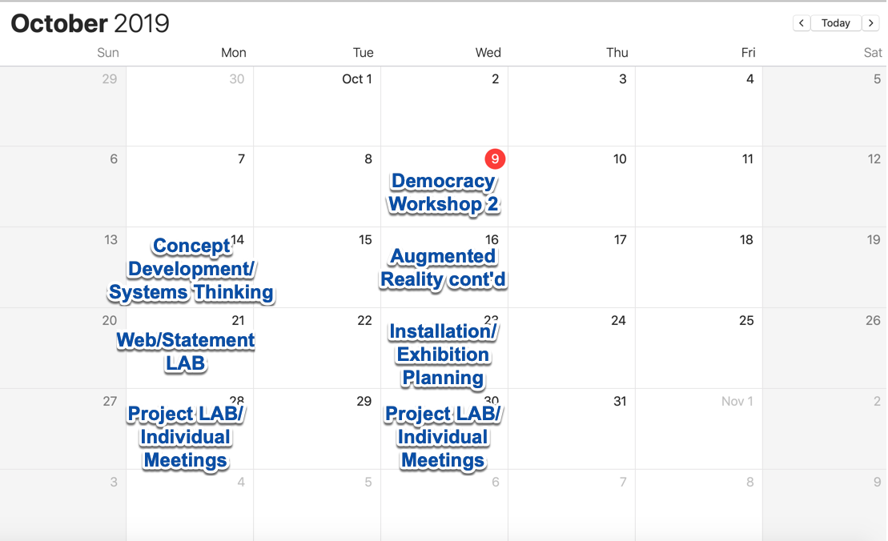
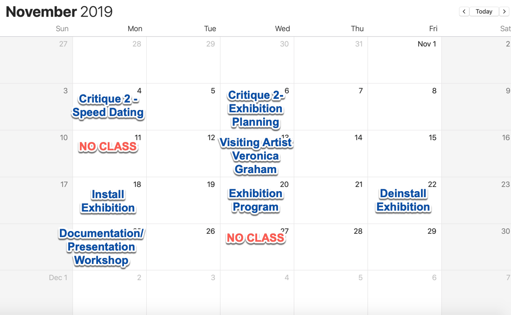
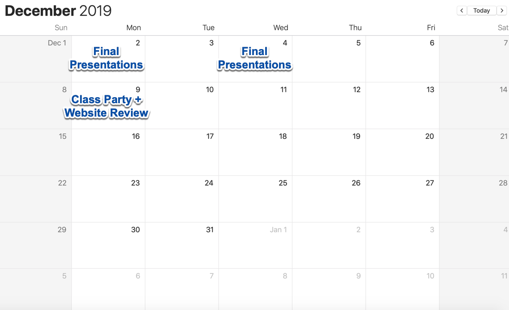

# **ADVANCED PROJECTS IN DIGITAL MEDIA ART**

|  Art 107 FALL 2019  | Course Information  | Course Content | Course Resources |
| -------------------------- |
| **Instructor:** Carrie Hott   **Office Location:** Art 311   **Office Hours:** Mondays 11:00am-12:00pm, or by appt   **Email:** carolyn.hott@sjsu.edu   | [Description](https://carriehott.github.io/sjsu-art107/#course-description)    [Schedule](https://carriehott.github.io/sjsu-art107/schedule)   [Assignments](https://carriehott.github.io/sjsu-art107/assignments)   [Expectations](https://carriehott.github.io/sjsu-art107/#course-expectations)  [Grading](https://carriehott.github.io/sjsu-art107/grading) | [Gallery](https://carriehott.github.io/sjsu-art107/critiques)  [Lectures](https://carriehott.github.io/sjsu-art107/lectures)  [Readings](https://carriehott.github.io/sjsu-art107/readings)   [Tutorials](https://carriehott.github.io/sjsu-art107/tutorials)| [Software](https://carriehott.github.io/sjsu-art107/programs)   [Resources](https://carriehott.github.io/sjsu-art107/resources)  |

 
 
 

# Course Schedule
_Note: This schedule is subject to change. You will be notified of any changes in a timely manner. Check Canvas and this website regularly for updates._

**Week** | **Date** | **Topics, Readings, Assignments** | **Deadlines**
------------ | ------------ | ------------- | -------------
1 | Wed 8/21 | Course Introductions and Syllabus Overview   Computer Setup + Intro to Systems Thinking reading |
2 | Mon 8/26 | Team hypothetical systems exercise Lecture: New Media Art & Systems Assignment: Project Proposals | Computer Preparation & Systems Reading response
2 | Wed 8/28 | Woodshop Day- Video & Safety test   Lecture/Discussion on overlap between New Media Art & Sculpture  |
3 | Mon 9/2 | LABOR DAY: NO CLASS | 
3 | Wed 9/4 | Project Proposal Presentations | Project Proposals & Presentations
4 | Mon 9/9| Demo/Workshop: Projection Mapping In-Class Exercise: Projection Mapping on specific shapes | 
4 | Wed 9/11 | Demo/Workshop: AR.js Augmented Reality In-Class Exercise: Augmented Reality |
5 | Mon 9/16 | Lab: In-Class Exercises   Share out group work| Projection mapping & AR.js exercises
5 | Wed 9/18 | Demo/Workshop: Processing & Arduino with sensors| Arduino In-Class Exercise |
6 | Mon 9/23 | Workshop: How To Represent Current System In The United States   | 
6 | Wed 9/25 | NO CLASS- Field Trip to Yerba Buena Center for the Arts on Saturday 9/28 | 
7 | Mon 9/30 | Demo/Workshop: Processing & Arduino with sensors | Project 1 of 3 complete
7 | Wed 10/2 | **Critique 1- At least one project**  | Field Trip Response + Project 1
8 | Mon 10/7 | **Critique 1- At least one project** | Project 1
8 | Wed 10/9 | Workshop 2: How To Represent District, Entity, & Relationships Between Them?   Assignment: Attend Jonathan Keates State of the Union Address Thursday, October 10 7:00PM in Hammer Theater|
9 | Mon 10/14 | Concept Development & Systems Thinking | In-Class exercise
9 | Wed 10/16 | Augmented Reality continued- adding object files & making custom markers | In-Class exercise
10 | Mon 10/21 | Web Development Review Professional Practices: Portfolio Sites & Artist Statements | In-Class exercise
10 | Wed 10/23 | Lecture: New Media & Installation Practices   In-Class Exercise: Hypothetical Installations | In-Class exercise
11 | Mon 10/28 | Project Lab/Individual Meetings | Project 2 in progress
11 | Wed 10/30 | Project Lab/Individual Meetings | Project 2 in progress
12 | Mon 11/4 | **Critique 2- Speed Dating** | Project 2 + 3rd project progress
12 | Wed 11/6 | **Critique 2- Exhibition Planning** | Project 2 + 3rd project progress
13 | Mon 11/11 | VETERANS DAY- NO CLASS | 
13 | Wed 11/13 | Visiting Artist: Veronica Graham  Artist Talk & Demo- Virtual Reality | 
14 | Mon 11/18 | Exhibition Installation  | Exhibition Project Complete
14 | Wed 11/20 | Class Exhibition opening & program | 
15 | Mon 11/25 | Documentation, Website, and Final presentation lab | Documentation of projects
15 | Wed 11/27 | THANKSGIVING- NO CLASS | 
16 | Mon 12/2 | **Final Presentations & Critique** | Final Presentations
16 | Wed 12/4 | **Final Presentations & Critique** | 
17 | Wed 12/9 | **Portfolio Website + Artist Statement Deadline & Party** | 
FINAL | Mon 12/16 |

