# **INTRO TO PREMIERE PRO- VIDEO EDITING TUTORIAL**

### **++[SJSU Art 107 Fall 2019](https://carriehott.github.io/sjsu-art107/)++**

[<Back to Tutorials](https://carriehott.github.io/sjsu-art107/tutorials)

**Intro to Premiere Pro** 
This tutorial reviews basics covered in class. For more Premiere Pro instruction, use your SJSU library card to access **[this Premiere Pro 2019 Lynda.com tutorial](https://www.lynda.com/Premiere-Pro-tutorials/Premiere-Pro-CC-2019-Essential-Training-Basics/758639-2.html)**.

##### Included on this page:

1. [Setup - folder template, Media Encoder, and renaming files](#setup)
2. [Keyboard shortcuts](#keyboard-shortcuts)
3. [Getting Started with Premiere](#getting-started-with-premiere)
4. [Aspect Ratio and Sequence](#-aspect-ratio-and-sequence)
5. [Clipping Footage](#clipping-footage)
6. [The Timeline](#the-timeline)
7. [Targeting Tracks](#-targeting-tracks)
8. [Adding Still Images](#-adding-still-images)
9. [Picture in Picture](#-picture-in-picture)
10. [Replace a Clip](#-replace-a-clip)
11. [Trimming a Clip](#-trimming-a-clip)
12. [Adding Transitions](#adding-transitions)
13. [Captions and Subtitles](#captions-and-subtitles-using-premieres-built-in-tool)
14. [Color Correction](#color-correction)
15. [More on Audio](#working-with-audio)
16. [Exporting](#exporting)

 
 

# Setup

* **Install Media Encoder CC from the Adobe Creative Cloud**

* **Create a folder for Video Art.**

TIP: Organize your files with a consistent folder structure *that's the same for all your projects*.

1. Create a folder for this class following this template

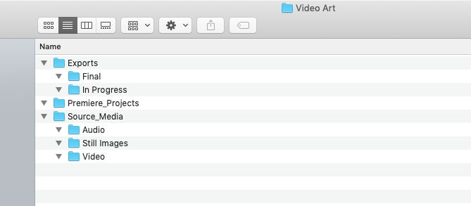

2. Download the sample footage from the class google drive folder, and add it to the Source Media > Video > folder

3. Add your sound art files to the audio folder

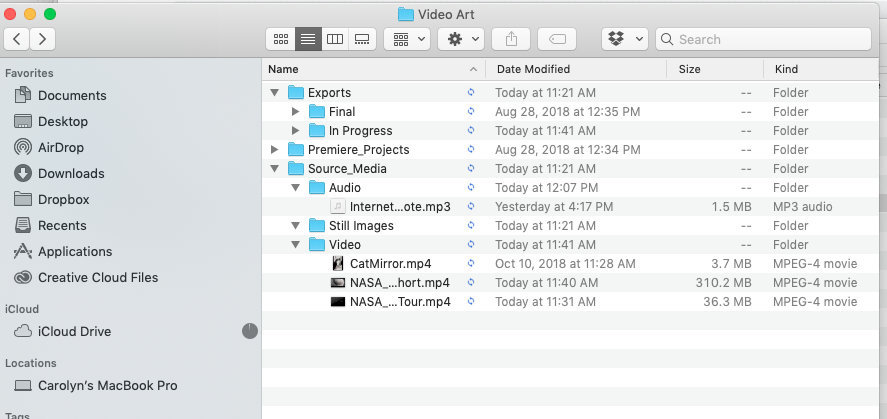

 
 

***Tip:***

*When you import footage from your phone or camera, it will probably have meaningless numbered names for the files. You should rename them something that indicates what the footage is. There are ways to rename files in batches with sequential prefixes.*

*For example:*

X679976.mp4
X679977.mp4
X679978.mp4

*magically transforms into:*

eveningShoot_Sam_00.mp4
eveningShoot_Sam_01.mp4
eveningShoot_Sam_02.mp4

**Tutorials for renaming all your footage files at once:**
* [Windows users](http://www.ubergizmo.com/how-to/batch-rename-files-windows/)
* [Mac users](https://www.imore.com/how-rename-multiple-files-once-mac)

 
 

# Keyboard Shortcuts

***TIME SAVERS***

Here is [a link](https://helpx.adobe.com/premiere-pro/using/default-keyboard-shortcuts-cc.html) to Adobe's full list of keyboard shortcuts. Below are notable ones to remember.

| Basic Operations          | Windows       | Mac         |
|---------------------------|--------------|-------------|
|       Save                | Ctrl+S       | Cmd+S       |
|       Save As...          | Ctrl+Shift+S | Shift+Cmd+S |
|       Import...           | Ctrl+I       | Cmd+I       |
|       Undo                | Ctrl+Z       | Cmd+Z       |
|       Redo                | Ctrl+Shift+Z | Shift+Cmd+Z |
|       Cut                 | Ctrl+X       | Cmd+X       |
|       Copy                | Ctrl+C       | Cmd+C       |
|       Paste               | Ctrl+V       | Cmd+V       |
|       Select All          | Ctrl+A       | Cmd+A       |
|       Deselect All        | Ctrl+Shift+A | Shift+Cmd+A |
|       Find...             | Ctrl+F       | Cmd+F       |

| Sequence shortcuts                                        | Windows             |  Mac           |
|--------------------------------------------------|--------------|-------------|
|       Play/Stop Toggle                           | Space or K   | Space or K  |
|         Play: Forward and Backward               | J,K,L        | J, K, L     |
|       Zoom In                                    | =            | =           |
|       Zoom Out                                   | -            | -           |
|       Match Frame                                | F            | F           |
|       Add Edit (like razor tool)                                | Ctrl+K       | Cmd+K       |
|       Add Edit to All Tracks                     | Ctrl+Shift+K | Shift+Cmd+K |
|            Render Effects in Work Area/In to Out | Enter        | Return      |
|       Apply Video Transition (dissolve)                     | Ctrl+D       | Cmd+D       |
|       Apply Audio Transition (cross-fade)                     | Ctrl+Shift+D | Shift+Cmd+D |
|       Lift                                       | ;            | ;           |
|       Extract                                    | '            | '           |
|       Mark In                                    | I            | I           |
|       Mark Out                                   | O            | O           |
|       Mark Clip                                  | X            | X           |
|       Go to In                                   | Shift+I      | Shift+I     |
|       Go to Out                                  | Shift+O      | Shift+O     |
|       Clear In                                   | Ctrl+Shift+I | Opt+I       |
|       Clear Out                                  | Ctrl+Shift+O | Opt+O       |
|       Add Marker                                 | M            | M           |
|       Go to Next Marker                          | Shift+M      | Shift+M     |
|       Go to Next Edit Point                      | Down         | Down        |
|       Go to Previous Edit Point                  | Up           | Up          |

| Tool Shortcuts       |   |   |
|----------------------|---|---|
|    Selection Tool    | V | V |
|    Track Select Tool | A | A |
|    Hand Tool         | H | H |
|    Zoom Tool         | Z | Z |
|      Slip Tool       | Y | Y |
|      Razor Tool      | C | C |

 
 
 

# Getting Started with Premiere

#### ▼ Open the Program

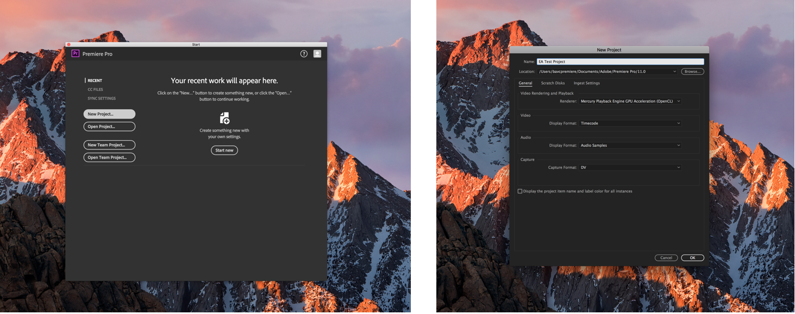

* When beginning a new project, choose new project.
* Route the Location to your Premiere-Projects folder in your Video Project folder
* In the next window, name your project
* Display format: Timecode
* Audio: Audio Samples
* Capture: DV (HDV is more compressed)
* Scratch Disks and Ingest Settings: Keep default

#### ▼ Set Up the Workspace

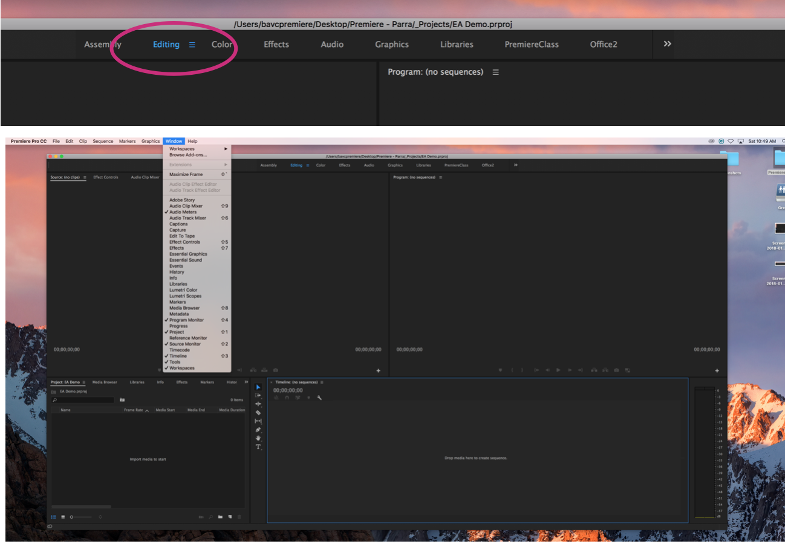

* Once the workspace is open, go to the ‘Editing’ interface. You can open new tabs in the ‘Window’ menu at the top.

#### ▼ What is the Workspace?

* The Editing Workspace is made up of four main panels: Source Monitor, Program Monitor, Timeline, Tool Palette, Project Panel, and Audio Meters

#### ▼ Import Footage

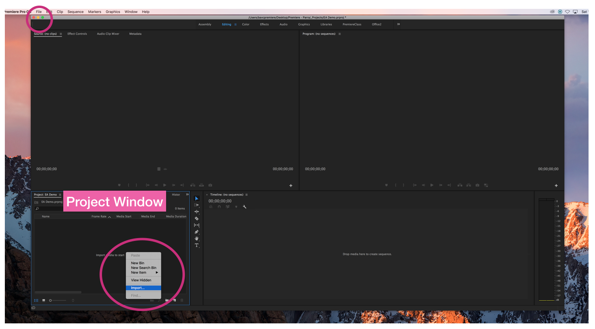

* From the Project tab in the Project Panel, hit Cmd I/Ctrl I or right-click in the panel and select ‘Import”.
* Locate footage on your computer and import
  - \*These should be in your Source Media > Video folder
* Once footage is in the Project tab you can hover over it to make sure it is the footage you want
* This footage is now available for use in your project!

#### ▼ Save Your Project
* If you haven't already, save your project now.
* An asterisk next to the file name means there are unsaved changes

#### ▼ View and Organize Footage

* Double click on footage and it will show in the Source Monitor
* In the Project tab, rename and organize footage as desired- keep organized according to type of shot
* Press Command + B (mac) or Ctrl + B (windows) to create new ‘bins’ (folders)
* DON'T SKIP THIS STEP--->>>> ***KEEP YOUR FOOTAGE ORGANIZED YOU WILL THANK YOURSELF LATER***

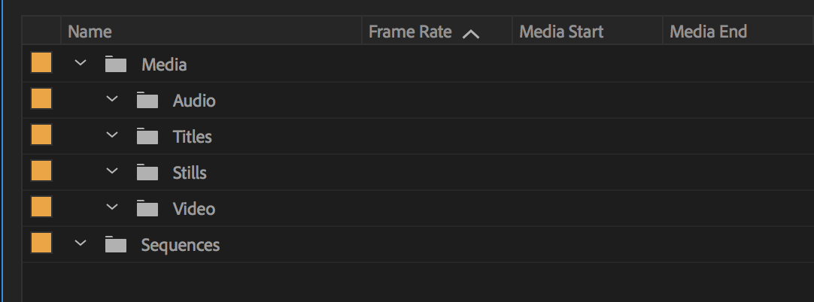
* ^ Here is an example of a folder structure for organization. You can create one that works for you.

# Aspect Ratio and Sequence

[Read and watch videos about resolution here](https://vimeo.com/blog/post/the-basics-of-image-resolution)

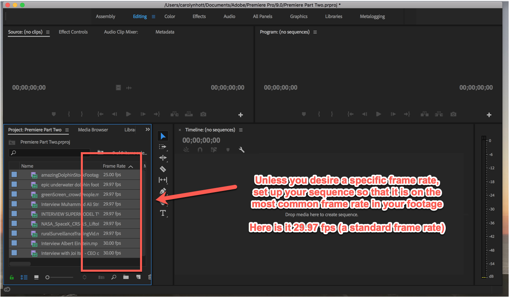

* When you drag a clip into the timeline, the new sequence in the timeline sets up settings to match that of the clip.
* If all of your clips are the same size and frame rate, then this is a good way to go.

* If your clips are different sizes and frame rates, and you have a specific outcome needed for your sequence, determine your aspect ratio and size by creating a sequence ahead of time.

* You can check your sequence settings by hovering over your sequence in the Project window (note: sequence icon vs stills vs audio/video)

* You can also right click and navigate to **'sequence settings'**

* Here you can make adjustments to the frame rate and aspect ratio if needed.

# Clipping Footage

#### Isolate clip within Footage

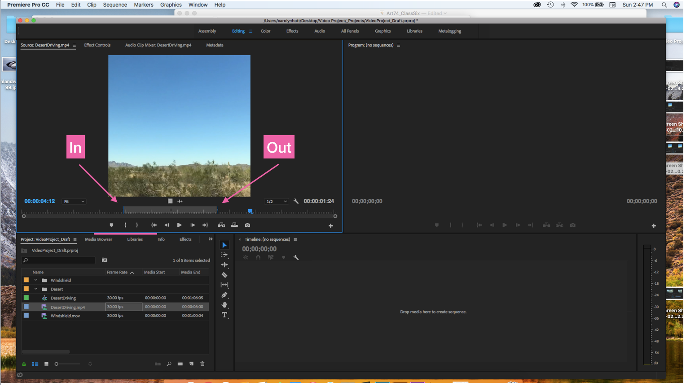

* You probably won't be using your entire clip, so you need to isolate the footage you want to edit
* Click in your Source Monitor panel and preview footage
  * Navigate footage with play / space bar
  * OR! use j k and l to go backwards and forwards. If you double click on one it will play twice as fast
* (You can bookmark places in your clip by using the ‘Marker’ arrows or by hitting m)
* To set your **in-point** - where you want your clip to begin - press ‘I’, or use the ‘Mark In’ tool ‘{‘
* To set your **out-point** - where you want your clip to end - press ‘O’ or use the ‘Mark Out’ tool ‘}’

# The Timeline

#### Put Footage in Timeline

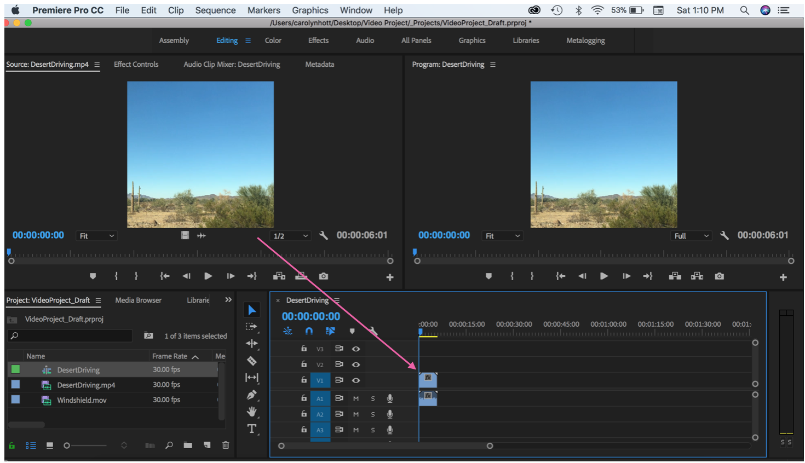

* Once your clip is selected (if you chose one), drag from Source Monitor to Timeline, to put your selected clip in the Timeline Panel
* It will show up on your timeline and automatically create a new sequence
* There are two bands: the audio below, and the video above.
* ---> name your sequence in the Project Tab and place it in an appropriate folder

#### View Timeline Project in Program Monitor

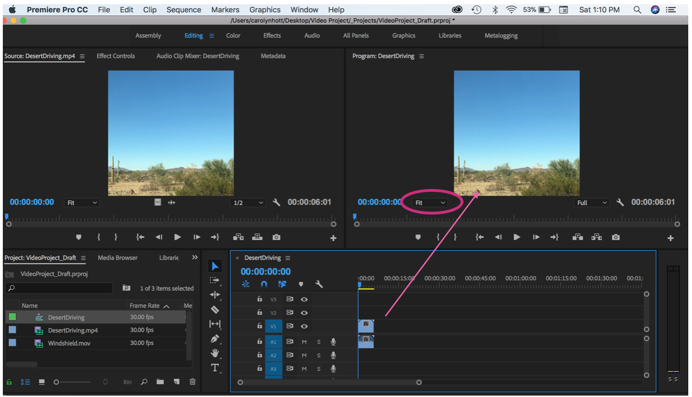

* When you press Play on the Program Monitor, or hit the Space Bar when in the Timeline, your footage will play.
* You can adjust the fit of your footage in the video under the dropdown menu ‘Fit’, where you can specify zoom percentages.
* You can double click on the video in the Program Monitor to reposition your footage =p

#### Add a Second Clip to the Timeline

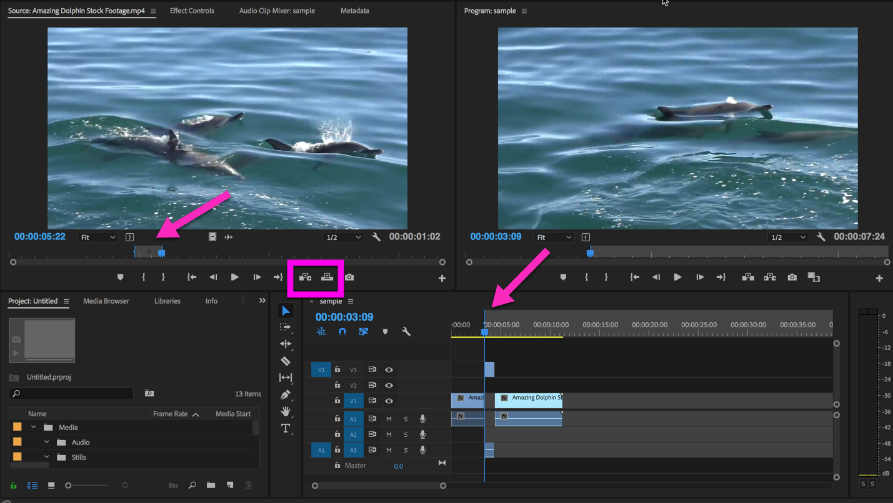

* There are many ways to add media into your timeline.
* The "3-point edit" is a more precise alternative to clicking and dragging
* To make a 3-point edit, mark an in and out point in the Source Panel, and *either* an in or out point in your Timeline Panel.
* Next, click on the **insert or overwrite icons** in the Source Panel
* Check out the difference between insert and overwrite:
  - Insert will scoot the existing footage over
  - Overwrite will plop it on top

#### ▼ View Sequence in Program Monitor

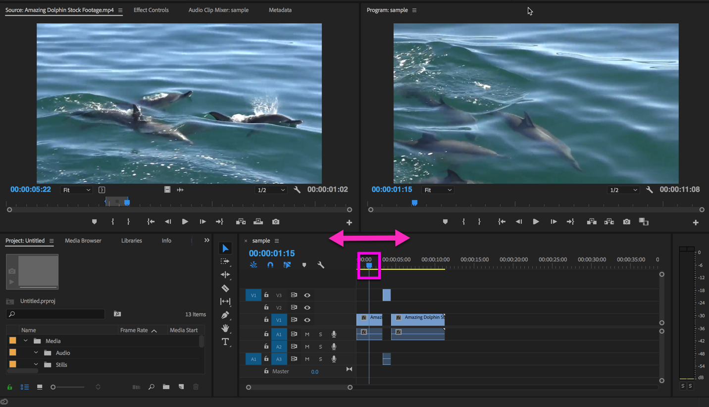

* Pull the Timeline Needle (or Playhead) to scroll through your timeline
* Hit the Space Bar (or j, k, l) to see your edits in the Program Monitor

# Targeting Tracks

- You can target tracks by pre-selecting V1 (video) or A1 (audio) before moving your clip to the timeline.

**Timeline Tips:**

Keyboard shortcuts for zooming in and out of ENTIRE Timeline: + or -
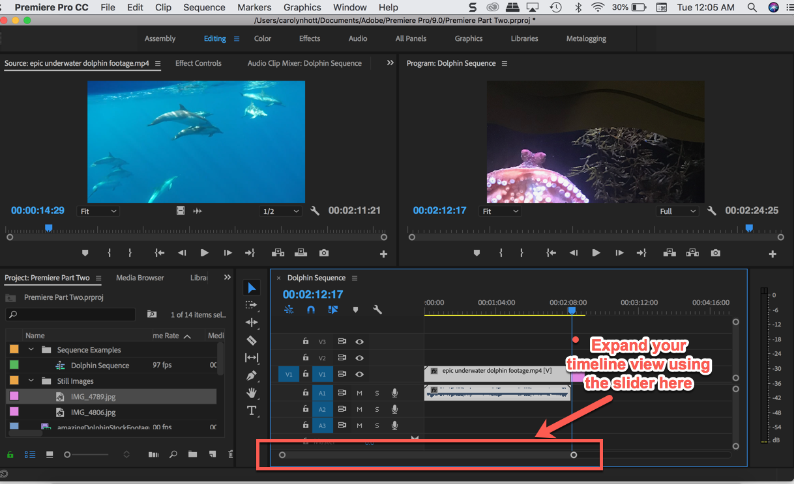
 
Keyboard shortcuts for expanding height of a track: Cmd/Ctrl + or -

# Adding Still Images

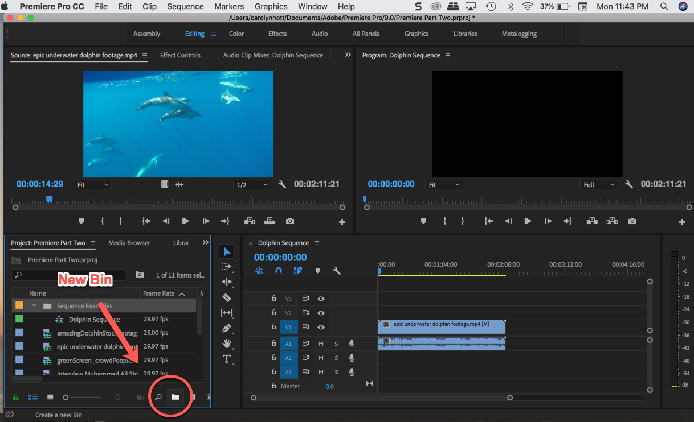

* Create a new Bin in your Project window for your still images.

* Click open the bin and double click in the window to import your still images.
* Once imported, you can view your source images in the source monitor as you did with your video files.

* You can drag your still images from the source monitor to the timeline, as with your video files.
* To lengthen the amount of time that the still is in your video, drag one side or the other of the box on your timeline.

# Picture in Picture

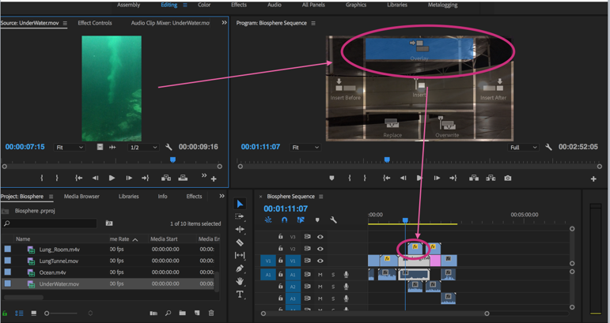
* To overlay a clip or still image on a sequence, first select your media file in your Project Panel and mark in/out if needed in the Source Monitor.
* Then drag from the Source Monitor to the Program Monitor, and a grid of options will appear> Hover and let go on **Overlay**
* Once you let go, the clip should appear in the V2 row of your timeline.
* You can then move it to the exact location in the sequence you would like.

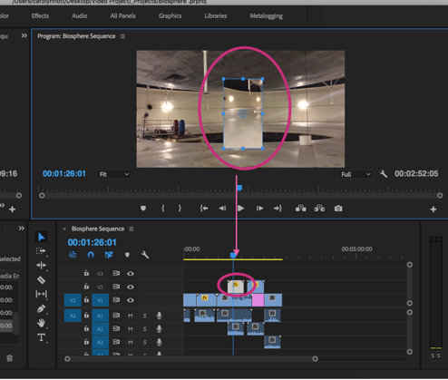

* To resize the clip that is overlaid, click on the clip in the Program Monitor and a wireframe and crosshairs will appear
* Drag the wireframe until the clip is the size you would like
* Move the image to the screen location you would like in your overall video

# Replace a Clip

 * To replace one clip with another, drag your new clip from the Source Monitor while holding Option/Alt key

 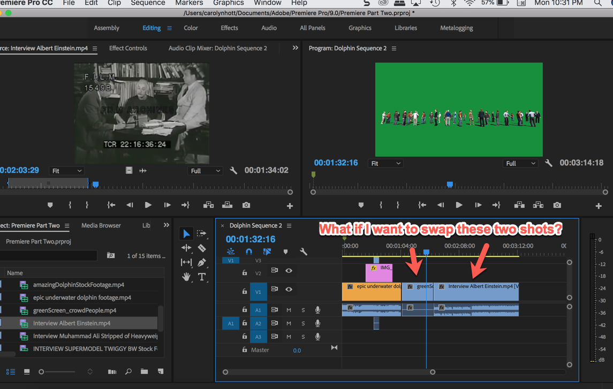

* If you want it to ripple = option delete
delete an area

 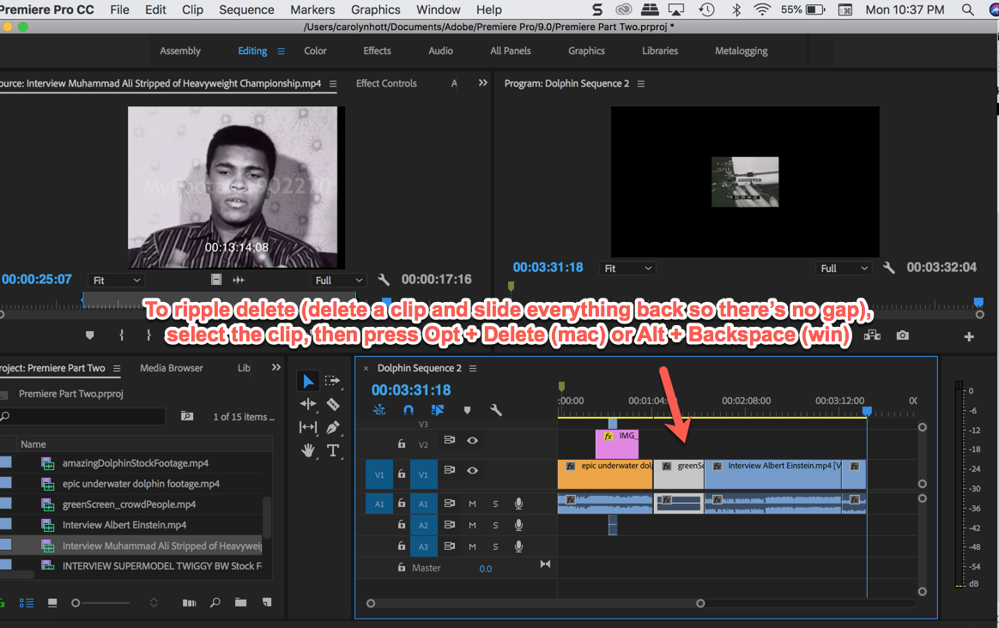

 

* You can use razor tool but marking in and outs is better ... use colon and apostrophe - this will only lift/extract the active tracks.

* Prepare the clip you would like to insert in the middle of a clip in your timeline in the Source Monitor (mark in/out if desired).

* Position your playhead in the timeline where you would like that clip to be inserted.

* Select the Source Monitor by clicking on it so it is highlighted, then press **,** (the comma key), and the clip will insert where the playhead is positioned.
 

# Trimming a Clip

When your clips in your timeline have rough in and out marks, you can do more precise editing in the timeline. many editors rough it in first and then come back and refine.

Use the **Ripple Edit Tool** or **B** key

**e** is the shortcut for extended edit - instead of dragging clip to cursor.

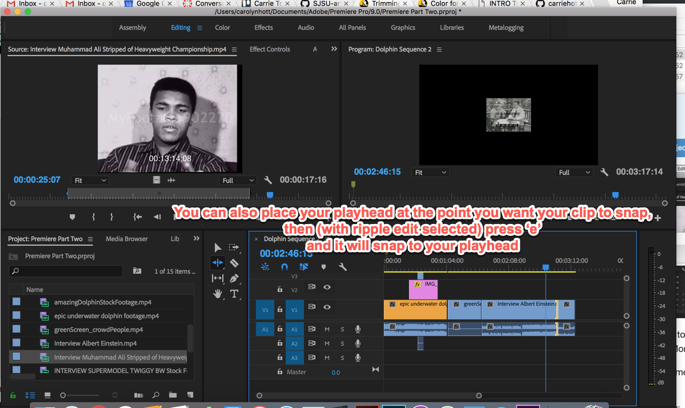

More options to try:  
* The rolling edit tool and rate stretch tool are hidden under ripple edit.
* Option and arrow will trim left or right once edge is selected
* If you want to edit just audio or video in synced clips, hold down Opt or Alt to just affect that track

# Rate Stretch Tool

* To expand a clip on your timeline (beyond the out point you set in the Source Monitor) just drag the footage using your mouse on the timeline to change duration
* You can also right click on the clip and select **speed/duration** to make adjustments to the speed and duration.

# Adding Transitions

#### ▼ Add Transition Effects

* Select the Effects Tab in the Project Window (where your source footage is)
* Click on Video Transitions to see a menu of transition types
* Click on Dissolves and select ‘Cross Dissolve’
* Drag from the Cross Dissolve box to the place on your Timeline where you want to transition (between your two clips)

 
 

#### ▼ View Transition

* The Cross Dissolve should appear as a bar that bridges two of your video clips (audio transitions are separate)
* Hover over the bridge with your mouse until a bracket appears- you can use this bracket to adjust the time span of the transition
* Play your project in the Program Monitor to view your transition
 
 

# Captions and Subtitles using Premiere's built-in tool

You can create individual titles, but Premiere has a specific tool for creating closed-captions
* [Adobe support docs (text)](https://helpx.adobe.com/premiere-pro/using/working-with-captions.html)
* [Basic video tutorial on Captions and Subtitles](https://www.youtube.com/watch?v=ZhHG4f-9MBY)

#### ▼ Add a Title

* Select the Graphics Workspace
* In the Essential Graphics window, select ‘Browse’
* In the list, select ‘Basic Title’

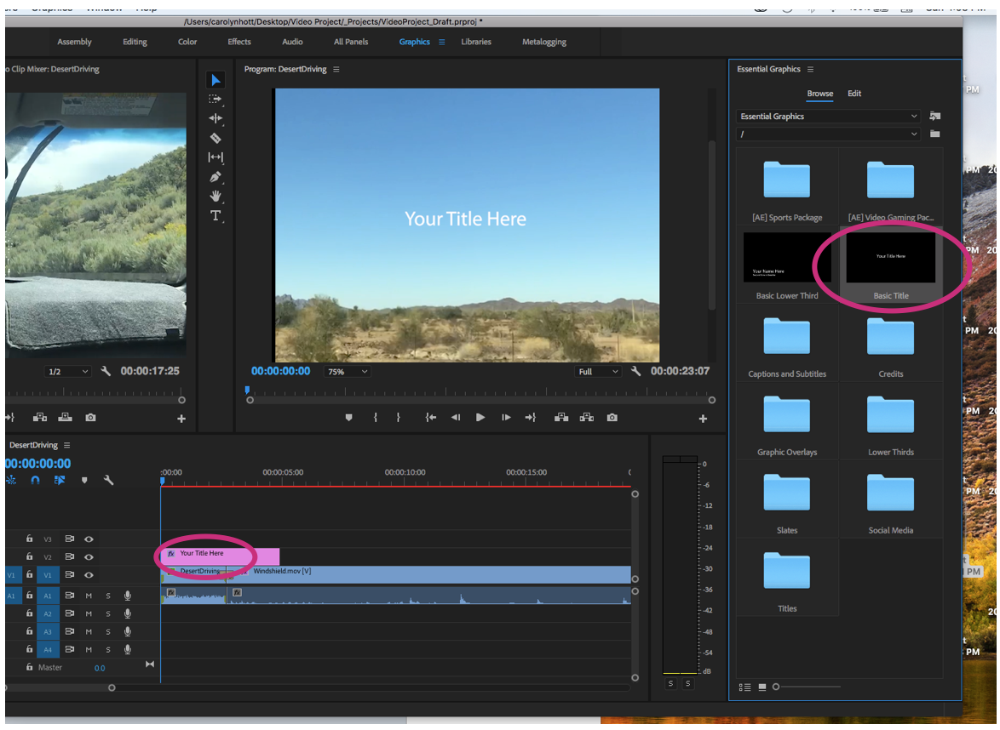

* Drag ‘Basic Title’ to your timeline and place it at the beginning of your project, above your first clip
* The text will appear at the center of the screen on your clip

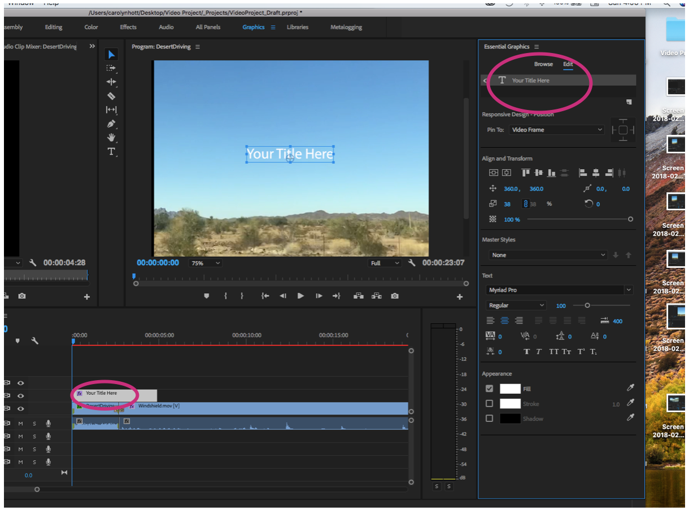

* Double click the title on your Timeline, then select ‘Your Title Here’ in the Graphics Window
* Click on the ‘Your Title Here’ box on your footage in the Program Monitor to type in your title. Move box to adjust placement.
* Adjust color and font size in the Text Window on the right side.

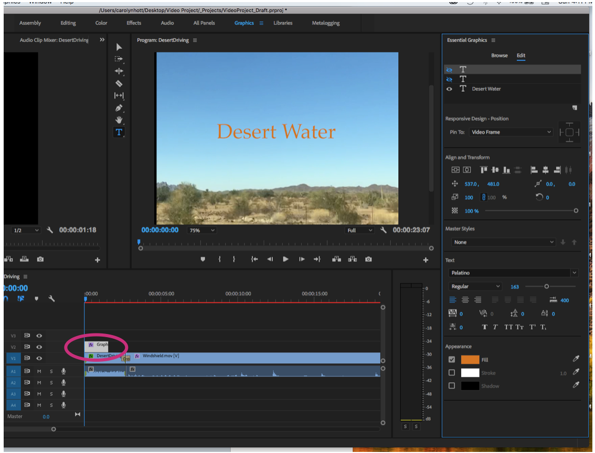

* Double click the title on your Timeline, then drag end backward or forward to adjust length of appearance in your project.  

 
 

# Color Correction

--> ***Tutorials:***
* [Adobe support docs (text)](https://helpx.adobe.com/premiere-pro/using/color-correction-adjustment.html)
* [Fast Color Corrector](https://www.youtube.com/watch?v=1drvNwiDEjU)
  * Easy color (white balance correction)
* [Basic correction with Lumetri](https://www.youtube.com/watch?v=0VDbf9VsZ88)

#### ▼ Adjust Exposure and Color

* In the Effects Panel, Select Video Effects, then select Color Correction, and then select Color Balance
* Drag the Color Balance icon over to the clip in your Timeline that you would like to adjust

* Select the Effect Controls tab, which is behind your Source Monitor
* Select Lumetri Color and scroll down to see the ‘Curves’ panel
* Here you can just Exposure, and Red, Green, and Blue (RGB!! Screen Colors) balance
* Select the Color and then move the curve to see the changes in the Program Monitor

 
 

# Working with Audio

---> ***Tutorials***
* [Adobe support docs (text)](https://helpx.adobe.com/premiere-pro/user-guide.html?topic=/premiere-pro/morehelp/audio.ug.js)
* [Basic audio levels and fades](https://www.youtube.com/watch?v=t0IAJSFl5Ww)
* [Fine-tuning with audio within Premiere](https://www.youtube.com/watch?v=MmiRBsAshOQ)
* [Noise reduction using Adobe Audition with Dynamic Link](https://www.youtube.com/watch?v=0C9Cc8zSHm4)

 
 

# EXPORTING

### ▼ Tip on selecting a region for export

When you export your sequence, Premiere will automatically export your entire timeline. If you have a clip set aside after the end of your sequence, Premiere will export that too.

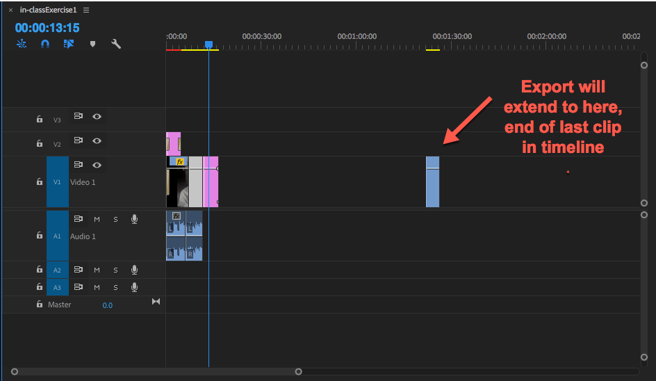

 

To get around this, you will need to activate the work area bar.

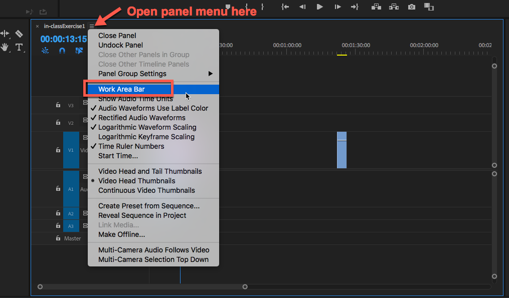

 
Now that you can see the grey work area bar, you can select just the region of your sequence you want to export.

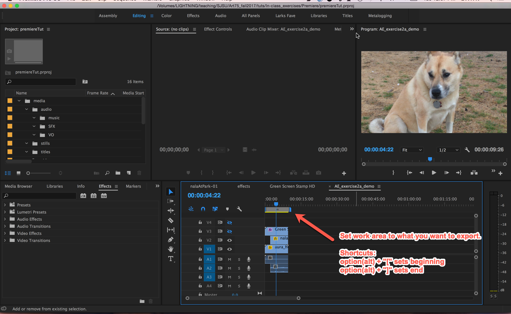

 

---

### ▼ Step-by-step guidelines for exporting

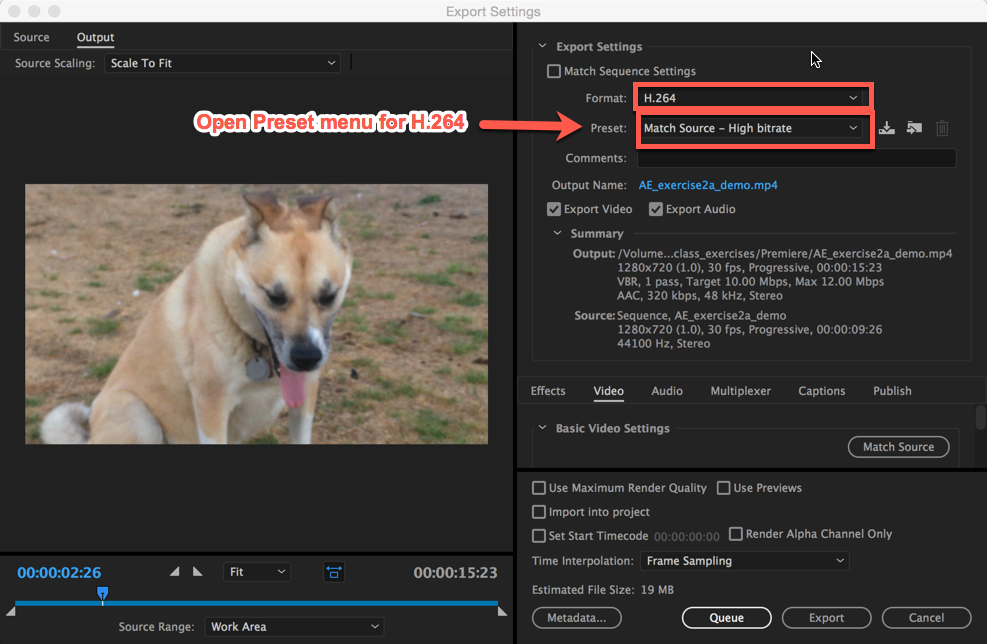

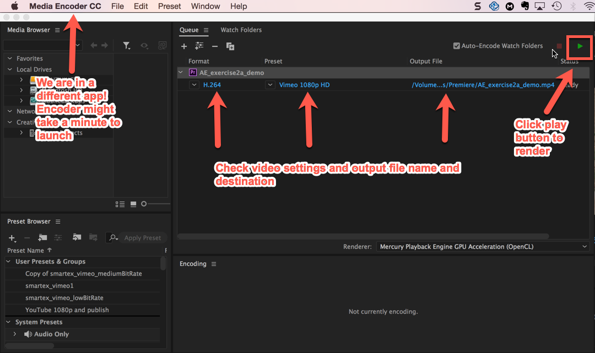
